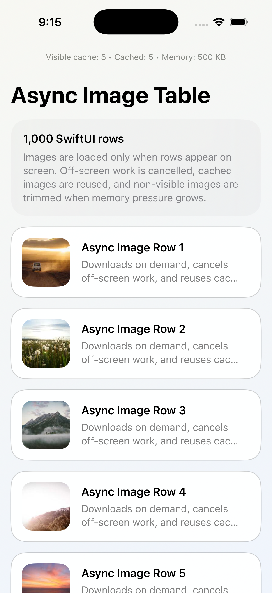

# AsyncImageTableDemoApp

  
  
  
  
  

  <strong>A SwiftUI sample app that shows how to load remote images the way real apps usually need to.</strong>

  Visible-row loading • async/await • cancellation • caching • memory-aware eviction

This project demonstrates a production-shaped async image-loading pipeline for a large SwiftUI list.

Instead of downloading images for every row up front, the app only starts work for rows that appear on screen, cancels work for rows that disappear, reuses cached images when possible, and trims non-visible images when memory grows too large.

## Demo

Add screenshots or recordings under `docs/media/` with these suggested filenames:

- `list.png`
- `memory-stats.png`
- `scrolling.gif`
- `demo.mov`
- `social-preview.png`

Suggested GitHub media section:

  
  

  

Full video walkthrough: [Watch the demo](docs/media/demo.mov)

## Why this repo is useful

Many image-loading examples stop at a simple `URLSession` call and a dictionary cache. This repo goes further and demonstrates the practical concerns that usually show up in real product code:

- loading only for visible rows
- cancelling work when rows leave screen
- avoiding duplicate downloads for the same URL
- reusing decoded images from memory cache
- protecting visible images while evicting older off-screen ones first
- explaining the architecture in a way that is easy to study and demo

## What it demonstrates

- 1,000 deterministic SwiftUI list rows
- async image fetching with `async/await`
- row lifecycle-driven loading via `onAppear` and `onDisappear`
- actor-backed image pipeline and cache
- in-flight request coalescing
- visibility-aware memory trimming
- a live cache summary shown in the UI

## How it works

1. A row becomes visible in the SwiftUI `List`
2. `PhotoRowView` triggers `onAppear`
3. `PhotoRowViewModel` requests the image from `ImagePipeline`
4. `ImagePipeline` first checks `MemoryImageCache`
5. If no cached image exists, a remote fetch begins with `URLSession`
6. If another row asks for the same URL, it joins the same in-flight task
7. When the row disappears, the task is cancelled and that URL becomes non-visible in cache state
8. When memory grows, non-visible images are evicted before visible ones

## Architecture

The project is intentionally split into three layers:

- SwiftUI views render rows and react to visibility changes
- row view models own per-row task lifecycle
- actor-backed services coordinate fetching, caching, and eviction

Best files to read first:

- `AsyncImageTableDemoApp/Views/PhotoListView.swift`
- `AsyncImageTableDemoApp/Views/PhotoRowView.swift`
- `AsyncImageTableDemoApp/ViewModels/PhotoRowViewModel.swift`
- `AsyncImageTableDemoApp/Services/ImagePipeline.swift`
- `AsyncImageTableDemoApp/Services/MemoryImageCache.swift`

More detail:

- [Architecture guide](docs/ARCHITECTURE.md)
- [Cache and memory behavior](docs/CACHE_AND_MEMORY.md)
- [Demo guide](docs/DEMO_GUIDE.md)

## Memory behavior

The app-level cache is configured with a budget of roughly 28 MB.

In practical terms:

- visible images are protected while their rows are on screen
- non-visible images are the first eviction candidates
- trimming runs after inserts, when rows become non-visible, and on memory warning
- the cache reports visible count, cached count, and estimated memory usage in the UI

For the full explanation, see [docs/CACHE_AND_MEMORY.md](docs/CACHE_AND_MEMORY.md).

## Running the project

1. Open `AsyncImageTableDemoApp.xcodeproj` in Xcode
2. Run the `AsyncImageTableDemoApp` scheme on an iPhone simulator
3. Scroll slowly to watch visible-row loading
4. Scroll quickly to observe cancellation
5. Scroll back upward to see cached image reuse
6. Watch the live cache summary in the navigation area

## Best demo flow

If you are showing this project to someone else:

1. Start at the top of the list and explain the problem
2. Scroll slowly and point out on-demand image loading
3. Scroll quickly and explain why off-screen work is cancelled
4. Scroll back upward and show cached reuse
5. Open the pipeline and cache code to connect the behavior to the architecture

A longer walkthrough is in [docs/DEMO_GUIDE.md](docs/DEMO_GUIDE.md).

## Who this is for

- iOS engineers learning better async image-loading patterns
- SwiftUI developers who want a realistic cache and cancellation example
- interview candidates who want a strong demo project
- content creators writing or recording Swift concurrency tutorials

## Tests

The test target focuses on the concurrency core rather than UI visuals.

It verifies:

- cache eviction behavior
- in-flight request coalescing

## Roadmap ideas

- disk cache support
- thumbnail downsampling
- request prioritization for near-visible rows
- debug overlay for cache hits, misses, cancellations, and evictions
- benchmark mode for scroll and memory behavior

## Documentation

- [Architecture](docs/ARCHITECTURE.md)
- [Cache and memory](docs/CACHE_AND_MEMORY.md)
- [Demo guide](docs/DEMO_GUIDE.md)
- [Media placeholder](docs/media/PLACEHOLDER.md)

## Contributing

If you want to improve the image pipeline, strengthen memory behavior, add debug tooling, or polish the demo experience, contributions are welcome.
